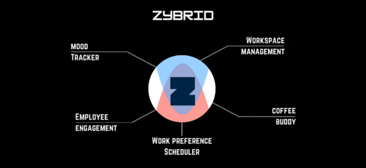
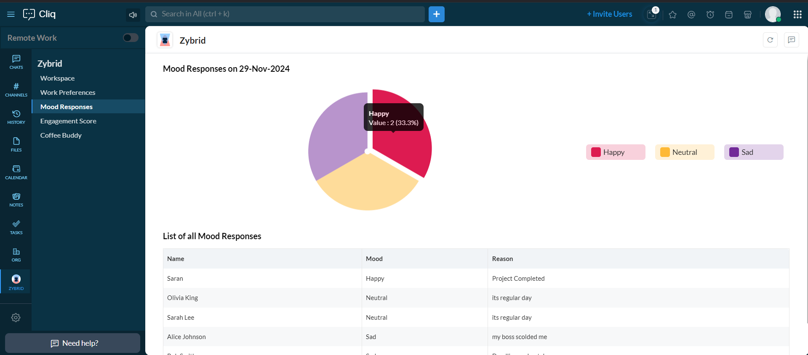
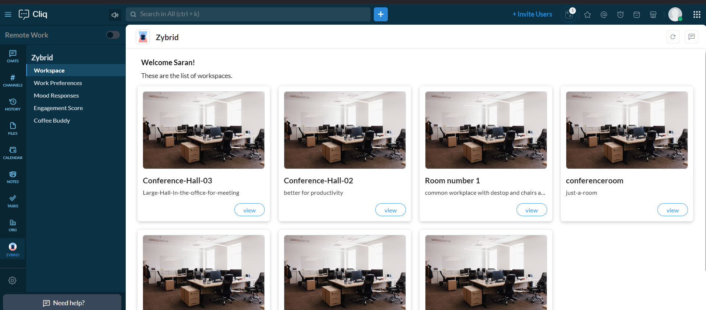
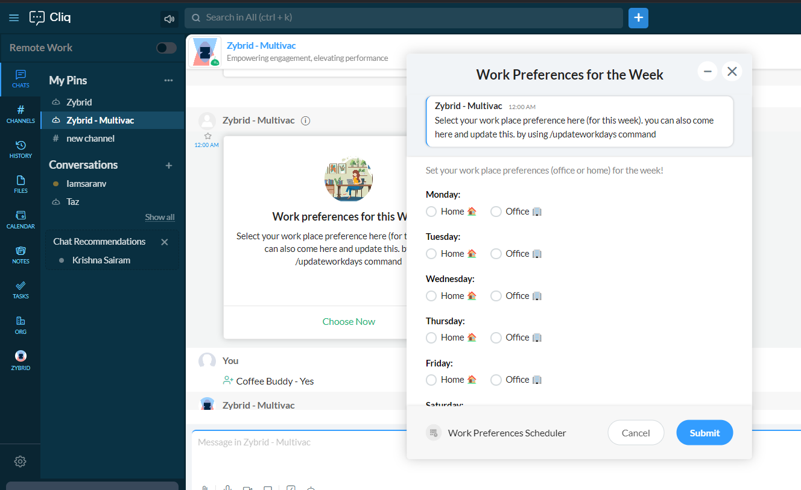
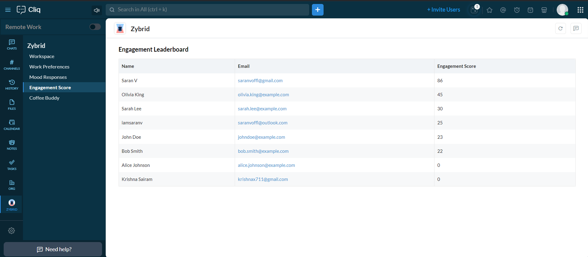
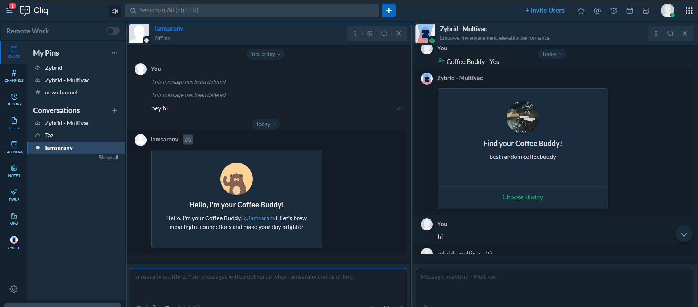

# Zybrid Extension - Hybrid Workplace Management and Engagement

Zybrid is an innovative extension that enhances hybrid workplace efficiency by enabling seamless work preference scheduling, mood tracking, workspace booking, and gamified engagement through intuitive bots and widgets. Designed for organizations adopting hybrid work cultures, Zybrid helps improve collaboration, boost employee engagement, and provide actionable insights for increased productivity and satisfaction.

## Features

- **Work Preference Scheduling**: Allows employees to set and update their work preferences for the week (Office/Home).
- **Mood Tracking**: Daily mood tracking to gather insights on employee well-being.
- **Workspace Booking**: Simplified booking of office workspaces for hybrid employees.
- **Coffee Buddy**: A fun feature that randomly pairs employees for informal chats, fostering team bonding.
- **Gamified Engagement**: Encourages participation in company activities, awarding points that show up on a leaderboard.
- **Employee Leaderboard**: Track engagement and recognize top contributors.

## Technologies Used

- **Deluge**: For building the logic behind the bot interactions, commands, and scheduling.
- **Zoho Cliq**: To integrate the bot and manage workspaces and preferences.

## Screenshots

## Project Structure
├── Functions
│   ├── storeUserData  
│   ├── checkAndBookWorkspace  
│   ├── LogMood  
│   ├── submitWorkPreferences  
│   └── coffeeBuddyFunction  
├── Databases  
│   ├── User Database  
│   ├── Mood Responses Database  
│   ├── Workspace Database  
│   └── Work Preferences Database  
├── Schedulers  
│   ├── Work Preferences Scheduler  
│   └── Mood Tracker Scheduler  
└── Widgets  
    └── Engagement Leaderboard  

*Example of Zybrid Extension in Zoho Cliq.*

